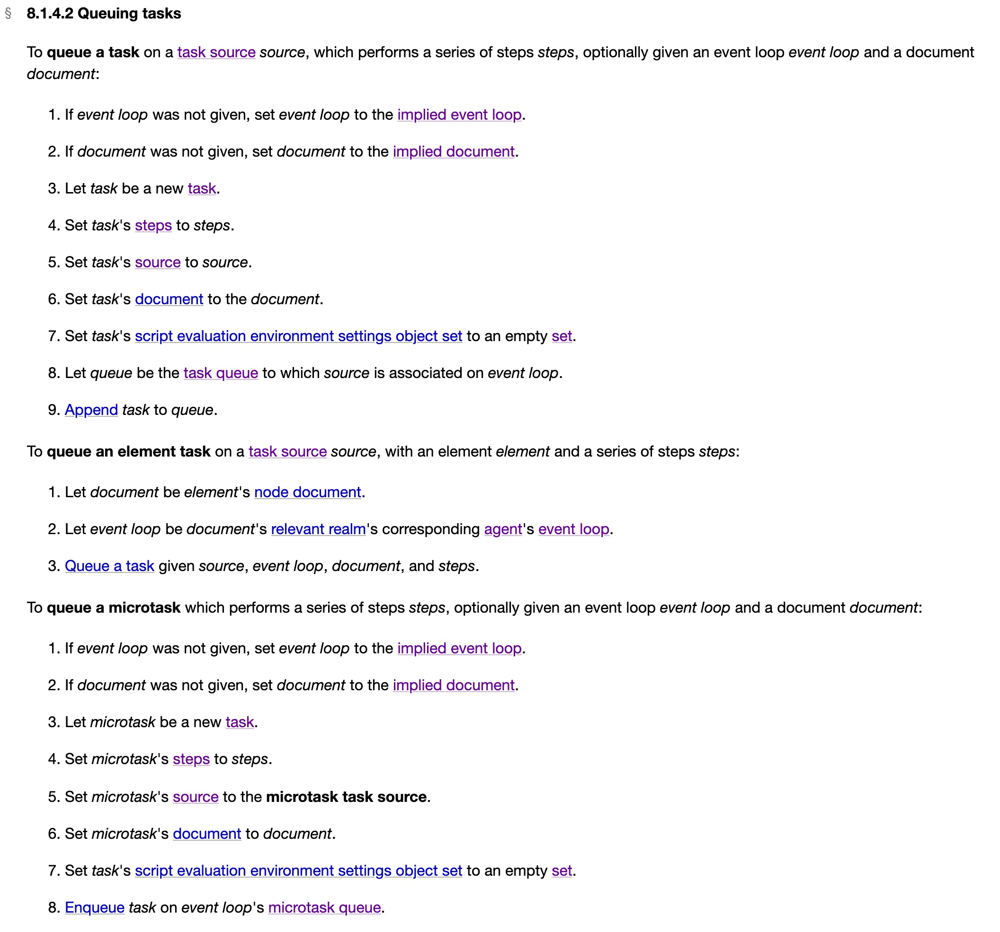

首先明确一点，事件循环这个概念并非JavaScript语言中的。在计算机科学中，事件循环作为编程结构或者设计模式，在程序中等待和发送消息或者事件。

EventLoop 也不属于 ECMAscript 规范中的一部分。ECMAscript只规定了JavaScript这门语言的特性。
就JavaScript语言本身而言，众所周知的单线程语言。但是其宿主环境可以是多线程的。在浏览器中除了JavaScript引擎线程之外，还有GUI渲染线程，事件触发线程等，在 Node.js 中有 `Libuv`提供线程池来模拟不同操作系统的异步调用。我们常说的 Javascript 的 EventLoop 依赖 JavaScript 依赖宿主环境的实现。

## 浏览器中的EventLoop

在[HTML规范](https://html.spec.whatwg.org/multipage/webappapis.html#event-loops)中有这么一段话：

> To coordinate events, user interaction, scripts, rendering, networking, and so forth, user agents must use event loops as described in this section. There are two kinds of event loops: those for browsing contexts, and those for workers.

为了协调事件、用户交互、脚本、UI 渲染和网络处理等行为，用户代理(浏览器)必须使用 `event loops`。而Event Loop 又可以通过[Agent](https://tc39.es/ecma262/#sec-agents)的类别分为三类。

所谓`Agent`，是一个包含执行上下文(exection contexts)，一个执行上下文栈(exection context stack)，一个运行时上下文(running execution context)，一个代理记录(Agent Record)和一个**执行线程(executing thread)**

浏览器中目前有包含三类：

1. similar-origin window agent：对应用户代理(浏览器)的主线程，执行上下文是全局执行上下文，其对应的事件循环称之为 `window event loop`。
2. dedicated worker agent, shared worker agent 和 service worker agent：这三个worker agent对应各自的执行线程和执行上下文，对应的事件循环称之为 `worker event loop`。
3. worklet agent：类似，事件循环称之为 `worklet event loop`。

### Task Queues

每个事件循环会有一个或者多个`任务队列(task queues)`。任务队列是一系列`任务(task)`的`集合(sets)`。注意这里说的`任务队列(task queues)`是[ Sets](https://infra.spec.whatwg.org/#sets) 不是 [Queues](https://infra.spec.whatwg.org/#queues)。
每一个事件循环都有一个 `当前执行中的任务(currently running task)`，这个任务可以为null，事件循环初始化时这个任务就是null。这个任务是可以重新载入。
每一个事件循环都有一个 `微任务队列(microtask queue)`，微任务队列是一个 `Queue`。

### Task

任务(task)是一个结构体，包含以下数据：

**Steps**：一系列任务需要做的事情
**source**：任务的来源，用来组织和序列化任务。每一个事件来源在任务队列中都有一个特有的任务队列与之相关。任务来源分以下几类：

1. DOM操作
2. 用户交互
3. 网络请求
4. 历史回溯。调用 `history.back()` 等相关API

**document**：一个与task相关的[`Document`实例](https://html.spec.whatwg.org/multipage/dom.html#document)。如果这个任务不在`window event loop`中，则`document`为`null`

**script evaluation environment settings object set**：环境配置对象集合，包含一个执行上下文

### 处理模型(Processing model)

当调用栈(call stack)是空栈时，按照下面的步骤来处理：

1. 选择任务队列中最早的那个任务(task A)。
2. 如果 task A 为 null(意味着任务队列为空)，跳到第6步
3. 将task A 设置为 `currently running task`
4. 执行 task A(task对应的回调函数)
5. 设置 `currently running task` 为 null, 移除 task A
6. 执行微任务队列
    * a. 从微任务队列中选择最早的任务 task X
    * b. 如果 task X 为 null (意味着微任务队列为空)，跳到第g步
    * c. 将 task X 设置为 `currently running task`
    * d. 执行 task X
    * e. 设置 `currently running task` 为 null, 移除 task A
    * f: 选择下一个队列中下一个任务，跳到第b步
    * g: 结束微任务队列
7. 跳到第1步

简单来说就是：

1. 先执行任务队列中最早加入的任务，然后移除这个任务
2. 执行微任务队列中所有的任务，然后移除这个任务
3. 下一轮：继续执行下一个任务队列中的任务(重复第二步)。直到没有可执行的任务。

关于处理模型的具体细节可参考 [Processing Model](https://html.spec.whatwg.org/multipage/webappapis.html#event-loop-processing-model)

### “宏任务”和微任务

什么是`微任务`，在规范中是这么定义的：

> A microtask is a colloquial way of referring to a task that was created via the queue a microtask algorithm

在规范中其实并没有提到“MarcoTask”这样的概念，只有 `Task` 和 `MircoTask` 之分，我们暂且就将不是微任务的任务称之为宏任务，具体来看二者入列逻辑步骤。

可以看到在这两类任务在前7步都是一样的，微任务在第八步是直接将任务入列至事件循环的微任务队列。注意这里是 `Queue`。而宏任务则是先找到一个任务源(task source)与事件循环相关连的任务队列，然后将这个任务入列至任务队列。

这么看来，二者的区别在于入列时的算法，并没有明确规定某一个任务到底采用何种规则入列。

在浏览器这个上下文中，macrotask有以下的种类：

1. 当外部或内部`<script>`标签所对应的脚本加载完成之后，执行这些脚本就是一个macrotask；
2. 当用户点击页面上的按钮，那么分发click事件后的对handler的执行就是一个macrotask；
3. 调用setTimeout或者setInterval时传入的callback的执行，就是一个macrotask;
4. 非标准全局方法setImmediate()调用时传入的callback的执行，就是一个macrotask;
5. requestAnimationFrame调用时传入的callback的执行，就是一个macrotask;
.......

microtask的种类有以下几种：

1. 在promise对象调用then/catch/finally的时候传入的callback的执行，就是一个microtask；
2. 显式地调用queueMicrotask(fn)来入队一个microtask时候，那么对这个fn函数的执行就是一个microtask;
3. new MutationObserver()传入callback的执行就是一个microtask;
4. Object.observe()传入callback的执行就是一个microtask。

## 参考

1. [difference-between-microtask-and-macrotask-within-an-event-loop-context](https://stackoverflow.com/questions/25915634/difference-between-microtask-and-macrotask-within-an-event-loop-context#)
2. [Using microtasks in JavaScript with queueMicrotask()](https://developer.mozilla.org/en-US/docs/Web/API/HTML_DOM_API/Microtask_guide)
3. [深入Event Loop](https://my.oschina.net/u/4357381/blog/4267179)
